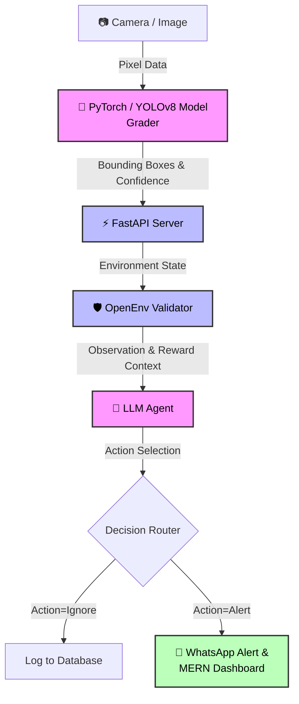

# 🗑️ Illegal Dumping Detection - A Real-World RL Agent

> **Transforming municipal surveillance into autonomous, intelligent monitoring.**  
> An end-to-end Reinforcement Learning (RL) environment built with the OpenEnv framework to detect illegal garbage dumping in real-time and autonomously decide the most effective corrective action.

[](#) *(Placeholder: Update with your Demo Video Link)*

 *(Placeholder: Update with your Banner Image)*

---

## 🌍 The Problem & Solution

**The Problem:** Illegal garbage dumping is a pervasive environmental issue that degrades public spaces, creates health hazards, and strains municipal resources. Traditional CCTV monitoring requires constant human oversight, making it inefficient and unscalable.

**The Solution:** We have developed a fully autonomous AI + RL system. By integrating edge computer vision with a sophisticated Reinforcement Learning environment, our system detects dumping events in real-time. An LLM-based agent then processes the environmental state and dynamically selects the best action—whether it's logging the event, alerting authorities, or issuing a fine—drastically reducing response times and human labor.

---

## 🏗️ System Architecture

Our solution uses a multi-modal pipeline, bridging raw sensor input to high-level decision-making and downstream automations.



---

## 🛠️ Tech Stack

We leveraged a modern, high-performance stack to ensure real-time capabilities and production-level reliability:

| Category | Technologies Used |
| :--- | :--- |
| **Computer Vision** | 👁️ PyTorch, YOLOv8 |
| **Agent / LLM** | 💬 OpenAI API, GPT-4 / Llama 3 |
| **Backend & Framework** | 🚀 FastAPI, OpenEnv Validator |
| **Automations & UI** | 🌐 WhatsApp API, Node.js, React (MERN Stack) |

---

## 🎮 The RL Environment Design

At the core of our system is a custom **OpenEnv-compliant Reinforcement Learning Environment**. It defines how our LLM agent perceives and interacts with the physical world.

- **👁️ Observation (State):** The specific image context and spatial relationships detected by the camera frame.
- **⚡ Action:** The deterministic decisions available to the LLM agent based on the observation. 
  - `Action 1:` **Ignore** (e.g., standard pedestrian activity, no dumping detected).
  - `Action 2:` **Alert** (e.g., validated illegal dumping event requiring municipal intervention).
- **🏆 Reward Function:** The system's objective function, scoring the agent's decisions to facilitate learning and evaluation. Our reward is strictly derived from PyTorch grading functions, utilizing **Confidence Scores** from the YOLO model and **Bounding Box Intersection over Union (IoU)**.

---

## ⚙️ Setup & Installation

Follow these steps to deploy the environment locally.

```bash
# 1. Clone the repository
git clone https://github.com/yourusername/illegal-dumping-detection.git
cd illegal-dumping-detection

# 2. Install the required Python dependencies
pip install -r requirements.txt

# 3. Configure Environment Variables
# Create a .env file or export these directly in your terminal:
export API_BASE_URL="http://localhost:8000"
export HF_TOKEN="your_huggingface_token_here"
export MODEL_NAME="your_preferred_llm_model"

# 4. Start the local backend server
uvicorn server.app:app --reload

# 5. Run the RL inference agent (in a separate terminal)
python inference.py
```

---

## 📂 Project Structure

A quick overview of the core architectural components:

```text
📦 illegal-dumping-detection
 ┣ 📂 ai_service
 ┃ ┗ 📜 garbage_env.py    # The core RL Environment logic (State, Step, Reset)
 ┣ 📂 server
 ┃ ┗ 📜 app.py            # FastAPI backend orchestrating API requests
 ┣ 📜 inference.py        # Main entry point for running the LLM Agent
 ┣ 📜 openenv.yaml        # OpenEnv configuration and validation rules
 ┣ 📜 graders.py          # PyTorch/YOLO vision grading logic (Score/IoU)
 ┗ 📜 requirements.txt    # Project dependencies
```

---
<div align="center">
  <i>Submitted for the <b>Meta PyTorch x Scaler OpenEnv Hackathon</b></i> 🚀
</div>
